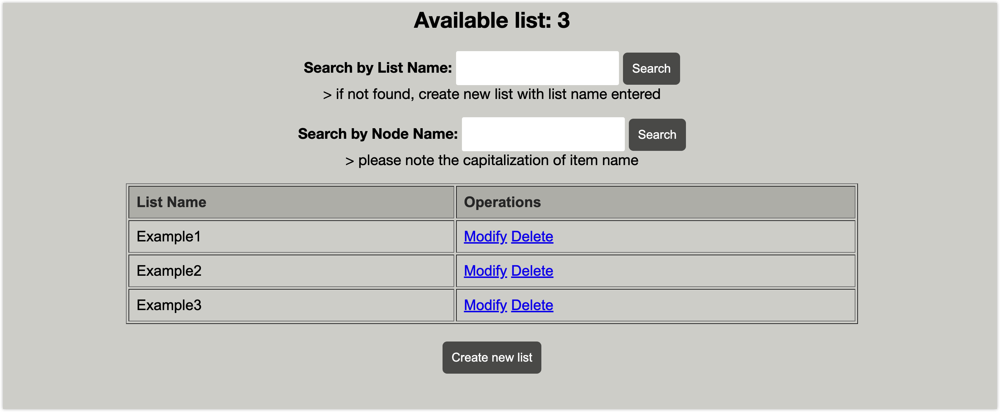

## Project Overview

This JavaWeb project is designed to efficiently store and manage multiple data types within a project. The core features include the ability to handle text, numbers, images, URLs, and links to other lists. The underlying data structure, **DoublyLinkedHashTable**, ensures O(1) time complexity for insertion, deletion, and search operations. The project provides a user-friendly interface for viewing, adding, deleting, and editing items. Additionally, it supports functionalities like renaming lists, creating new lists, and real-time updates. The project's frontend is built using JSP files written in JSTL.

## Running instructions

### Install Maven and JDK

+ This project utilizes Maven for managing project dependencies. If Maven is not installed on your system, please follow the instructions on the [Maven website](https://maven.apache.org/install.html) (Maven 3.8+)
+ Also the project use Java as main language. If java is not installed, please follow the instruction on the [Oracle website](https://www.oracle.com/java/technologies/downloads/) (JDK 17+)

### Building Project Dependencies

+ Navigate to the project directory and execute the following Maven command to clean and install dependencies:

  ```shell
  mvn clean install
  ```

### Run the com/stephen/main/Main.java

+ After successfully compiling and executing Main.java, go to the browser and access ```localhost:8080```

## Sample Display

+ Starting page:

  

+ Press **'START'** and enter the overall list display :

  

+ Choose one of the list, you are able to modify them by click on **'Modify'** and delete them by click on **'Delete'**:

  

+ You are able to add a node after click on **'Add new node'** and follow instructions below:

  

+ On the top of the page, you are allow to search a node by their name. And website will return all matched result (entered "Item1" for test):

  

+ Tips: List name should be unique but nodes could have same names.

## UML Class Diagram

The project's architecture is represented through a UML Class Diagram, created using StarUML. The diagram showcases the design of crucial classes such as **Image**, **Node**, **DoublyLinkedHashTable**, **NodeTypeAdapter**, **DoublyLinkedHashTableTypeAdapter**, **Main**, **InitServlet**, and **UserServlet**. Each class plays a vital role in achieving the project's objectives.


## Feature Highlights

### 1. DoublyLinkedHashTable

- Implements a doubly linked hash table for efficient data storage.
- O(1) time complexity for most operations, optimized for network transfers.
- Supports insertion, deletion, and modification operations.
- Persists data through JSON file storage.

### 2. Image Class

- Handles the representation of images, supporting local addresses or URLs.
- Uses Base64 encoding for simplified image data transfer.
- Provides clear interfaces for setting up and retrieving image sources.

### 3. Node Class

- Generic class capable of storing multiple object types.
- Uses an ArrayList for flexible content storage.
- Provides interfaces for adding content, getting/setting names, and managing content size.

### 4. NodeTypeAdapter & DoublyLinkedHashTableTypeAdapter

- GSON type adapters for converting objects to JSON and vice versa.
- Exception handling for cases where file opening fails.

### 5. Main Class

- Responsible for starting the Tomcat server and deploying resources.
- Ensures orderly handling of requests and responses.

### 6. InitServlet & UserServlet

- InitServlet initializes doubly linked hash tables from JSON files.
- UserServlet handles user requests, ensuring flexibility and extensibility.
- Attention: InitServlet may create examples when the database is empty, introducing potential overhead.

### 7. JSPs

- Utilizes JavaServer Pages Tag Library (JSTL) and EL expressions for simplified code.
- Interfaces with servlets for operations on Nodes and Doubly Linked Hash Tables.